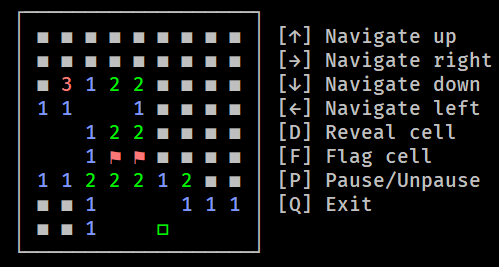

# Minetest



Minetest is a Python implementation of the classic game Minesweeper for the terminal. It is a text-based game where the player must reveal all of the squares on the board without hitting a mine. If the player hits a mine, the game is over.

The game is played in the terminal by only using the keyboard to move around the board and reveal cells. The player is also able to mark cells as suspected mines and pause the game.


## Motivation

This project was initially started during a course in software testing and was later used as a starting point in a course on maintenance programming. Although there aren't many tests implemented, the tests that have been implemented have been carefully curated and reasoned about to be as concise and comprehensive as possible.

The maintenance that has been performed on the code has mainly been about Additive, Preventative and Perfective maintenance types, as described by Michael Feathers in [Working Effectively with Legacy Code. Prentice Hall PTR, USA. 2004](https://learning.oreilly.com/library/view/working-effectively-with/0131177052/).

The name Minetest is a spin on the original motivation behind this project, from the words minesweeper and testing.

## Noteworthy features

- Well-thought-out and modular menu system which makes it straightforward to add more options and menus.
- Support for smaller terminal sizes by displaying the board and available actions in different configurations.
- Different color schemes for displaying the board in.

## Installation and Usage

Start by cloning the repo to your local machine.

Then move on to installing dependencies by running:
```
pip install -r requirements.txt
```

Start the game by running:
```
python src/game.py
```

### Command line arguments

This project supports the following command line arguments:

`--seed`: Sets the random seed to the specified value. This can be useful for reproducing results or debugging.

`--input`: Whether to use another input mode than pynput, which is the default. This can be useful for inserting input to the game via other means than a global listener.

`--ignore-size`: Whether to ignore the terminal size when printing the board.

To use a command line argument, simply pass it to the program when you run it. For example, to set the random seed to 1234, you would run the program as follows:

```
python src/game.py --seed 1234
```

## Testing

To run all tests, both unit and system tests, navigate into the source directory and run Python's native unit test functionality, which will find and run all defined tests:
```
cd src
python -m unittest
```

If you instead want to run individual test files, specify exact file(s) with the same command like the following:
```
python -m unittest tests/<test_file_name>
```

If you want more precise information printed when running the tests, add the `-v` flag to show verbose output.

### System Tests

To run only the system tests, run the following command:
```
python -m unittest tests/test_game_system.py
```

## Authors

Casper Norrbin, Joel Sikström, Jakob Wallén.

Contributing authors: Erik Sik and Oskar Gådin took part in the early stages of development.
